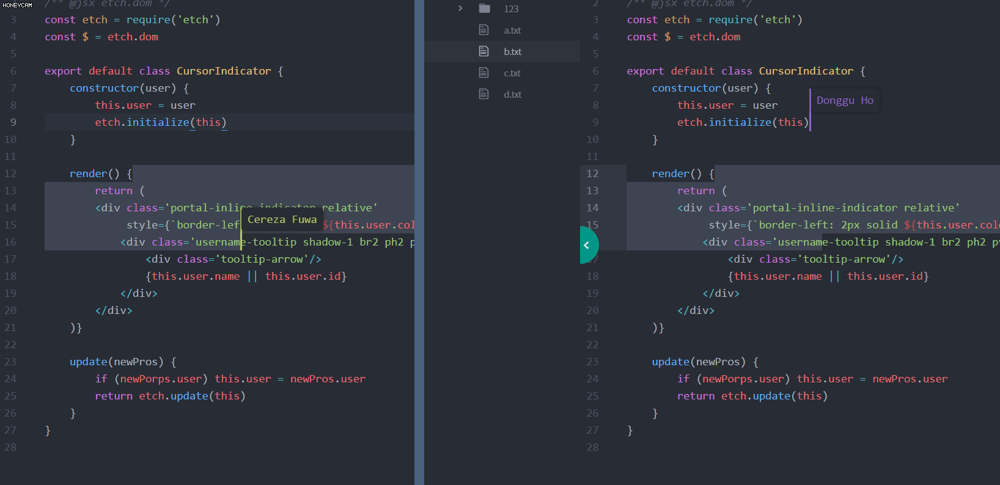
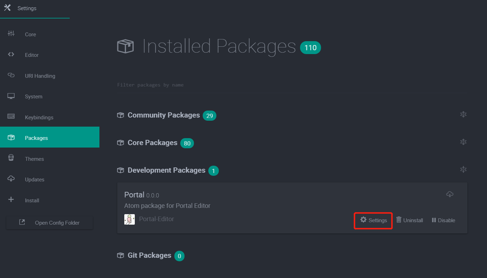

# Portal-Atom
An atom package for Portal

## Usage
### Set up conifguration

- Press `Ctrl/Cmd + Shift + P`, input and select command `Settings View: View Installed Packages`
- In "Develop Packages" section, click on "settings" of Portal package.
      

- You can setup your Portal server address here. The server address is set to be the qcloud server of the team. You may change it to your localhost address for debug purpose. As for the server side code, please refer to [Portal-Backend](https://github.com/cscw-and-se/co-atom-backend)  
  _note: GitHub Authorization is in process so its config doesn't work_

### Share your workspace
- Add an existed project folder that you want to co-work with others to your current Atom window. It can be a folder with some existed directories and files.
- Click on the **Portal** button on status bar. Input your user ID and turn on **Share**.
- You can see your portal Id. Tell others your portal ID and wait for their join~

### Join an existed portal
- Add an empty project folder to Atom
- Click on the **Portal** button on status bar. Input your user ID and the portal ID you want to join in. Click **Go**.
- The workspace codes will be immidiately downloaded to the projectfolder and you can co-work with others now. All editing will be transfer and replay in realtime

## Code structure
- use [etch](https://github.com/atom/etch) to build atom elements
- use async/await

## Development Instruction
As the package has not been release yet, you cannot install it from https://atom.io/packages. Please follow these instruction on developing purpose:

- Install the latest version [Atom](https://atom.io/) and [Git](https://git-scm.com/) in your environment
- Clone this repo to your local system and intall the dependencies  

      git clone https://github.com/Portal-Editor/Portal-Atom.git
      cd Portal-Atom
      npm i
- link the repo to Atom

      apm link --dev
- start atom in dev mode

      atom -d
- Two way to toggle Portal in Atom:   
  1. Press `Ctrl/Cmd + Shift + P`, and input the command `Portal: toggle`
  2. or simply press `Ctrl + Alt + O`(may not work in MacOS)
  
  You can see the "Portal" is shown in the right of status bar.
